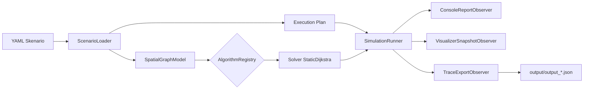

# Tutorial: Data-Driven Simulation Runner

Tutorial ini menjelaskan bagaimana pipeline simulasi berbasis data (YAML) dijalankan, dari file skenario hingga visualisasi, log kuantitatif, dan ekspor trace JSON. Tutorial ini juga mencakup cara menjalankan **1 kasus, beberapa kasus, hingga seluruh 28 kasus** sekaligus.

---

## 1. Konsep Data-Driven

Prinsip utama proyek ini: **skenario adalah data, bukan kode**. Seluruh detail kasus (topologi graf, bobot jalan, event dinamis, titik start/goal) didefinisikan dalam file YAML di `cases/scenarios/`. Kode Python hanya berisi mesin eksekusi yang generik — menambah kasus baru **tidak perlu mengubah kode sama sekali**.



Komponen dan tanggung jawabnya (Single Responsibility Principle):

| Komponen | File | Tanggung Jawab |
| --- | --- | --- |
| `ScenarioLoader` | `cases/scenario_loader.py` | Membaca YAML, membangun `SpatialGraphModel`, menyediakan `execution_plan` |
| `AlgorithmRegistry` | `algorithms/registry.py` | Pabrik solver: memetakan key algoritma → kelas konkret |
| `SimulationRunner` | `core/simulation_runner.py` | Orkestrasi fase (rute awal → event → selesai) + pengukuran waktu |
| `SimulationObserver` | `core/simulation_observers.py` | Visualisasi, laporan konsol, dan ekspor trace — bisa dipasang-lepas |

---

## 2. Struktur File Skenario YAML

Semua skenario memakai skema flat berikut:

```yaml
case_id: "case_08_warga_nonton"
title: "Judul kasus yang mudah dibaca"
description: "Narasi singkat konteks kasus."

nodes:
  - id: 0
    label: "Nama Tempat (Start)"
    pos: [0.0, 0.0]          # koordinat untuk visualisasi spasial
  # ... (spesifikasi N=5 node)

edges:
  - from: 0
    to: 1
    weight: 2.0              # bobot (jarak/waktu) untuk pathfinding & MST
    capacity: 10.0           # kapasitas untuk max flow
  # ...

execution_plan:
  start_node: 0
  goal_node: 4
  algorithm: pathfinding     # OPSIONAL: override registry key
  events:
    - step: 1
      type: "DYNAMIC_EDGE_WEIGHT"
      target_edge: [1, 3]
      new_weight: 99.0
      description: "Narasi event yang membumi."
```

### Tiga Varian Tipe Event

Setiap kategori algoritma mengonsumsi tipe event yang berbeda:

| Tipe Event | Field Kunci | Kategori Algoritma | Jumlah Kasus |
| --- | --- | --- | --- |
| `DYNAMIC_EDGE_WEIGHT` | `target_edge`, `new_weight` | Pathfinding (Dijkstra/D* Lite), Spanning Tree | 14 |
| `DYNAMIC_EDGE_CAPACITY` | `target_edge`, `new_capacity` | Max Flow (Ford-Fulkerson/Dinic) | 7 |
| `CONFLICT_NODE_TRIGGER` | `target_node` | Graph Coloring (DSATUR/Greedy) | 7 |

Jika solver yang aktif tidak mendukung tipe event tertentu, runner akan **melewatinya dengan aman** dan mencetak `[EVENT SKIPPED]` — bukan crash. Ini dimungkinkan oleh deklarasi `SUPPORTED_EVENT_TYPES` di kelas algoritma (lihat Bagian 5).

---

## 3. Menjalankan Simulasi

Semua perintah di bawah dijalankan dari root proyek. Disarankan memakai venv: `venv\Scripts\python.exe`.

### Satu kasus (default: `case_08`)

```bash
python -m scripts.run_simulation
```

### Kasus tertentu

```bash
python -m scripts.run_simulation cases/scenarios/case_09_kebocoran_gas.yaml
```

### Beberapa kasus sekaligus (misal 3 kasus)

```bash
python -m scripts.run_simulation cases/scenarios/case_01_kobra_banjir.yaml cases/scenarios/case_04_pasar_tumpah.yaml cases/scenarios/case_05_tawuran_pelajar.yaml
```

### Seluruh folder (semua kasus di dalamnya)

```bash
python -m scripts.run_simulation cases/scenarios
```

### Seluruh 28 kasus

```bash
python -m scripts.run_simulation --all
```

### Override algoritma secara eksplisit

```bash
python -m scripts.run_simulation --all --algorithm pathfinding
```

Prioritas pemilihan algoritma (yang paling kiri menang):

1. Argumen CLI `--algorithm`
2. Key `algorithm:` di dalam YAML (bagian `execution_plan` atau metadata)
3. `DEFAULT_ALGORITHM` di `config/settings.py`

> **Batch terkurasi:** isi `DEFAULT_SCENARIO_BATCH` di `config/settings.py` dengan daftar path YAML. Jika CLI dipanggil tanpa argumen, batch inilah yang dijalankan. Kosongkan untuk kembali ke skenario default tunggal.

---

## 4. Benchmark Performa

Perintah yang sama berlaku untuk benchmark, dengan output tabel ringkasan (runtime & step count per kasus):

```bash
python -m scripts.run_benchmark                          # skenario default
python -m scripts.run_benchmark cases/scenarios/case_14_gapura_roboh.yaml
python -m scripts.run_benchmark --all                    # seluruh 28 kasus
python -m scripts.run_benchmark --all --algorithm pathfinding
```

---

## 5. Arsitektur SOLID & Cara Menambah Algoritma

Runner **tidak pernah hardcode** kelas solver. Algoritma mendaftarkan dirinya ke `AlgorithmRegistry`:

```python
# algorithms/pathfinding/static_dijkstra.py (contoh existing)
class StaticDijkstra(BaseGraphAlgorithm):

    SUPPORTED_EVENT_TYPES = frozenset({"DYNAMIC_EDGE_WEIGHT"})
    ...

AlgorithmRegistry.register("static_dijkstra", StaticDijkstra)
AlgorithmRegistry.register_alias("pathfinding", "static_dijkstra")
```

Contoh ketika mahasiswa mengimplementasikan algoritma **Minimum Spanning Tree**:

```python
# algorithms/spanning_tree/prim_mst.py
from algorithms.registry import AlgorithmRegistry
from core.base_algorithm import BaseGraphAlgorithm

class PrimMST(BaseGraphAlgorithm):

    SUPPORTED_EVENT_TYPES = frozenset({"DYNAMIC_EDGE_WEIGHT", "DYNAMIC_EDGE_CAPACITY"})

    def run(self, start_node, goal_node):
        ...  # logika Prim + self.log_step(...)

    def handle_dynamic_event(self, event_data):
        ...  # reaksi terhadap perubahan bobot/kapasitas

AlgorithmRegistry.register("prim_mst", PrimMST)
AlgorithmRegistry.register_alias("spanning_tree", "prim_mst")
```

Setelah itu YAML cukup diberi `algorithm: spanning_tree` (atau jalankan dengan `--algorithm spanning_tree`) tanpa mengubah kode runner sama sekali — inilah **Open/Closed Principle**. Deklarasi `SUPPORTED_EVENT_TYPES` menjelaskan kontrak event (Interface Segregation), dan runner hanya bergantung pada abstraksi `BaseGraphAlgorithm` (Dependency Inversion).

Pemetaan 28 kasus ke 4 kategori algoritma tersedia di [CASESS.md](CASESS.md).

---

## 6. Menambah Skenario Baru

1. Salin salah satu YAML di `cases/scenarios/` sebagai templat.
2. Ubah `case_id`, `title`, `description`, topologi node/edge, dan event.
3. Simpan dengan nama `case_XX_nama_kasus.yaml` (ekstensi `.yaml` atau `.yml`).
4. Selesai — skenario otomatis terbaca oleh `--all`, glob folder, dan test parametrized.

---

## 7. Test Otomatis

```bash
venv\Scripts\python.exe -m pytest            # seluruh test
venv\Scripts\python.exe -m pytest -v         # output terperinci per kasus
venv\Scripts\python.exe -m pytest tests/test_all_scenarios.py   # audit 28 skenario
```

`tests/test_all_scenarios.py` berisi test **parametrized** yang mengaudit setiap file skenario secara otomatis:

- Metadata lengkap (`case_id`, `title`).
- `execution_plan` valid (`start_node`, `goal_node` ada di graf).
- Algoritma baseline menemukan rute valid dari start ke goal.
- Event yang didukung solver menghasilkan rute ulang yang valid.
- Event yang tidak didukung tetap valid strukturnya (edge/node target ada di graf).
- Delta log terekam konsisten (`step_count` == jumlah log).

Test ini dihitung otomatis dari isi folder — begitu Anda menambah YAML baru, test barunya ikut jalan tanpa edit kode test.

---

## 8. Output & Troubleshooting

Setiap simulasi mengekspor trace JSON ke `output/output_<case_id>.json` berisi metadata, topologi awal, dan `raw_quantitative_trace` (seluruh mutasi state per step).

| Gejala | Penyebab | Solusi |
| --- | --- | --- |
| `FileNotFoundError` saat load | Path YAML salah / file tidak ada | Periksa path; gunakan `--all` atau path folder |
| `KeyError: 'algorithm' ... tidak terdaftar` | Key algoritma belum diregistrasi | Cek `AlgorithmRegistry.available()`; daftarkan kelasnya dulu |
| `[EVENT SKIPPED]` di konsol | Bukan bug — tipe event memang bukan ranah algoritma aktif | Jalankan dengan algoritma kategori yang sesuai |
| Jendela matplotlib tidak muncul saat test | Backend headless (Agg) dipakai pytest | Normal; jalankan `run_simulation` biasa untuk melihat GUI |
